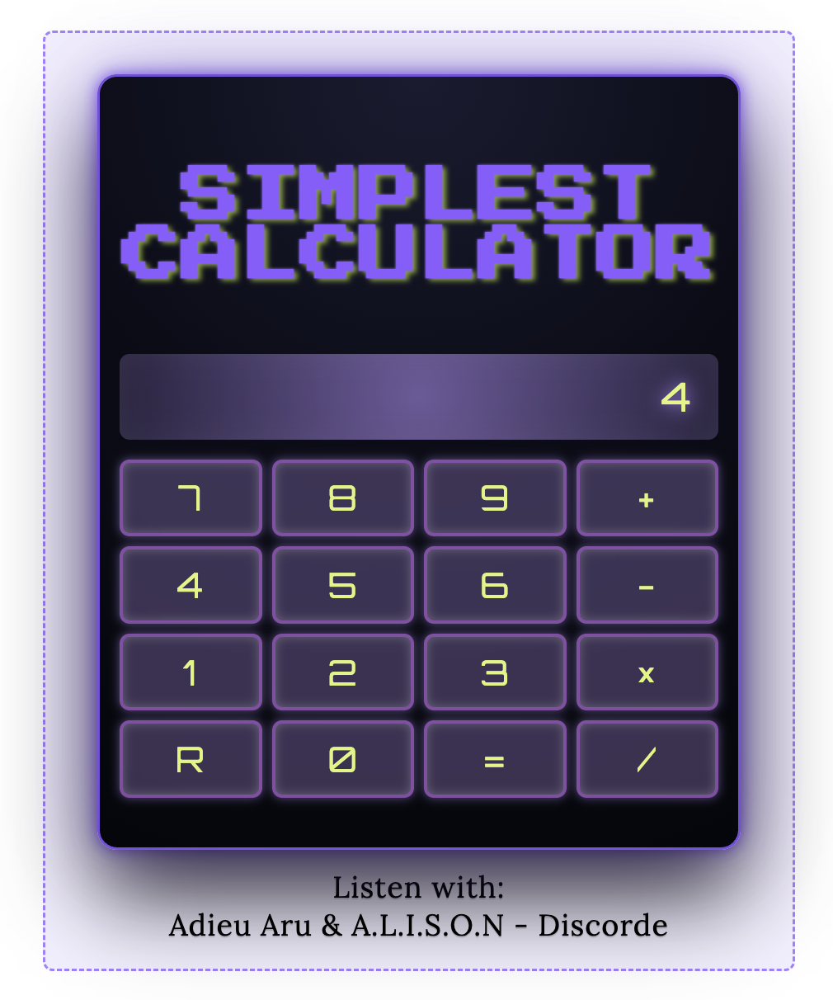

Simplest Calculator (React + Vite)
A retro-styled, single-digit calculator built with React and Vite, focusing on clean state management, keyboard input, and foundational React concepts like re-renders, controlled state, and event handling.

This project is intentionally simple — the goal is clarity, learning, and a polished UI experience.

About Vite
This project was created using Vite, a modern build tool and dev server that replaces older setups like Create React App (CRA).

Vite provides:
* Instant startup using native ES modules
* Lightning-fast hot reloads
* Optimized production builds (via Rollup)
* Simpler configuration and modern tooling

Vite is now the recommended standard for building modern React applications due to its speed and developer experience.

Listen With (Optional)
To complement the calculator’s neon cyber aesthetic, the UI includes a small personal touch. Try listening while using the app to enhance the experience.

Listenwith : Adieu Aru & A.L.I.S.O.N – Discorde

Preview

Features
* Single-digit numerical input only (0–9)
* Input via button clicks or ⌨️ keyboard keys
* Four operators: add, minus, multiply, divide
* Supports operation chaining
* Keyboard shortcuts:
    * 0–9 → digits
    * + - × / → operators
    * Enter → equals
    * Escape → reset
* Cyber-inspired UI with gradients, glow effects, and custom design tokens
* Defensive preventDefault() to avoid browser defaults interfering with keyboard input

Input Rules
This calculator intentionally supports only one digit at a time:
* Accepts a single digit (0–9) for each operand
* Digits can be entered by clicking buttons or typing
* Operators only work after the first digit is entered
* Multi-digit numbers are not supported (planned enhancement)

What I Learned
* How React state updates trigger re-renders, not full resets
* Key differences between:
    * React re-render
    * Browser reload (resets all state)
* Managing multiple pieces of related state via useState
* Using the functional updater: setPrintScreen(prev => { ... })
* Building controlled display output using .trim(), regex, and .slice()
* How and why event.preventDefault() is used for keyboard input (not necessary for this app version)
* Attaching & cleaning up event listeners with useEffect
* Enhancing UI accessibility with semantic HTML and aria-live attributes

Tech Stack
* React (Hooks)
* Vite
* JavaScript (ES6+)
* CSS Grid + Flexbox
* Custom design tokens (spacing, radii, fonts)

